# Washington Powerball/Powerplay Lottery
Team Members: Erika Evergarden '2020', Jamee Jones '2021', Evan Woodard '2022'

# Project Description
first to determine if there are any common powerball, powerplay, white numbers from the winning numbers.
second to see if max jackpot winnings have increased over time.

All data is pulled from the Washington state Powerball from June 2014 to November 2022.

The first question we attempted to answer by performing analysis on the mode values for the powerball, powerplay, and white numbers from the winning numbers.

The second question we performed analysis on the the max jackpots for each month, and then for each year.  Linear regression analysis is performed to see if there is any correlation between the max jackpots and the passage of time.
 
# Data Source
The data source is from Kaggle https://www.kaggle.com/datasets/stetsondone/lottery-data-winning-numbers-and-jackpots as an aggregate comma seperated values. This CSV file covers past lottery data in Washington State from June 2014 - November 2022. The original source was pulled from Lottery Corner - https://www.lotterycorner.com/wa/powerball/2022. 
This file includes the following data: 

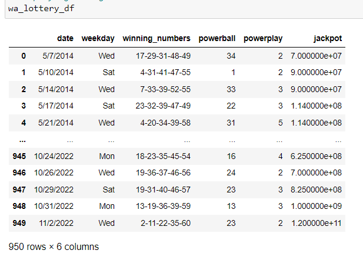

date - date of winnings

weekday - day of week winnings were announced

winning numbers - string of winning numbers for jackpot

powerball - Winning powerball number; If your Powerball matches the one that is drawn you will get your $2 ticket purchase back and a couple of bucks more, for a total of $4.

powerplay - Winning powerplay number - for an additional $1 per play, the powerplay feature multiplies non-jackpot prizes. The multiplier number is randomly selected just before each drawing.

jackpot - total jackpot amount in USD

# Exploratory Questions
1. What were the most common winning powerball/powerplay numbers depending on the day?
   
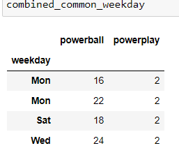

The Powerball winning numbers were selected on Monday, Wednesday, and Saturday in our data.  Monday had two most common winning Powerball numbers 16 and 22, while Wednesday had 24, and Saturday had 18.  The most common Powerplay winning number was 2 for all days of the week.

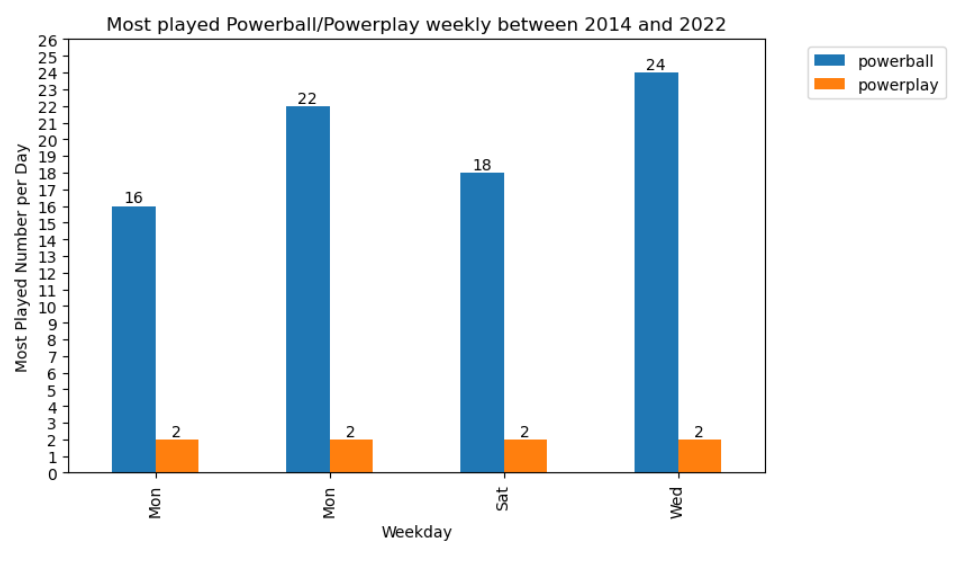

   
2. What were the most common powerball/powerplay numbers depending on the month?

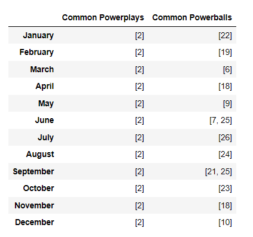

We used a mode function to find the most common winning Powerball/Powerplay numbers per month.  For every month, the Powerplay winning number was 2.  While the there was a plethora of winning Powerball numbers, 6, 7, 9, 18, 19, 20, 21, 22, 23, 24, 25, and 26.  Taking these numbers and graphing them on a bar chart actually helped us see that there were two Powerball numbers that occurred twice 18 on April, and November, and 25 on June, and September.  

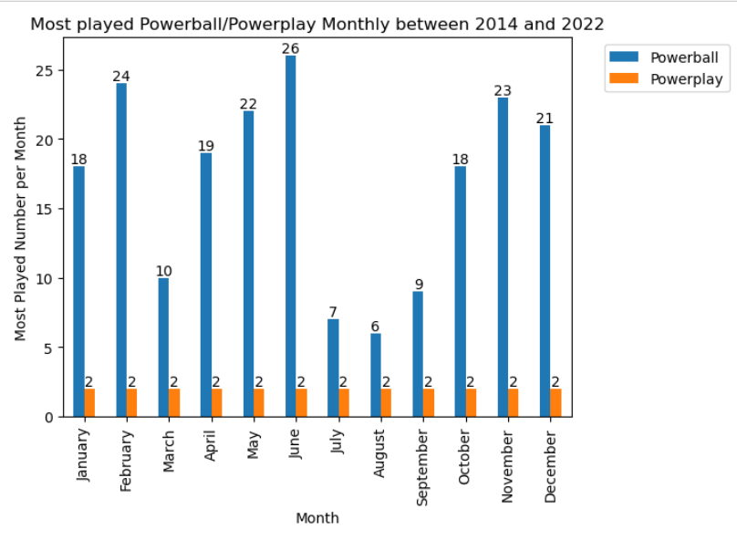

Another interesting note to be made on Powerball winning numbers is that the numbers 18 through 26 occurred.  We found that to be unusual, given that there are 1 through 26 Powerball numbers to choose from.  It is curious that the random selection picked a sequential unbroken line of numbers, and that the algorithm that is used to pick these numbers favor the last nine numbers for Powerball.

4. What were the top five most common Winning White numbers numbers overall?  

The White Numbers are much more extensive than Powerball and Powerplay values.  The winning White Number values are harder to visualize in a table format so we made a bar graph to represent the most common winning White Numbers.

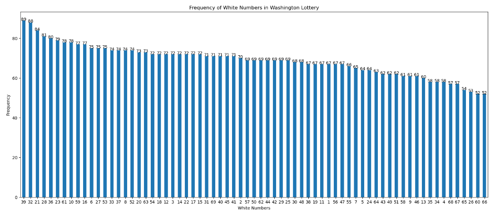

The top five most common White Numbers that we found, are 21, 28, 32, 36, 39.  We chose to only identify the top five most common winning White Numbers since players can only choose five White Numbers at a time. Looking at the White Number Frequency bar graph we started to wonder if lower numbers or higher numbers were more favored as the winning White Numbers.  So we performed a linear regression.

The correlation coefficient was -0.22 showing that their is a weak correlation, however, it seems that the lower White Number values were more favored by the algorithm to win than higher White Numbers.  This is inverse to what we found with the Powerball values.

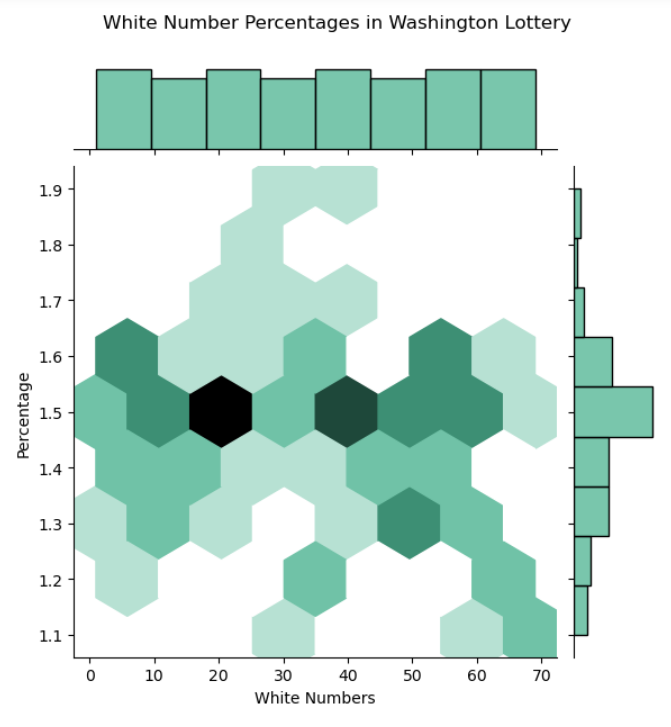

This last graph was done to show a heatmap of the most common White Numbers and their percentage from the total population of White Numbers choosen.  From this graph we can see that the most common percent sits around 1.5%, and that the most common White Numbers that were choosen sit between 20 and 40.  While the further you go past 40, the higher White Numbers start to fall from 1.5% down to less than 1.1%.

5. What were the maximum jackpots per month between June 2014 to Novemeber 2022?

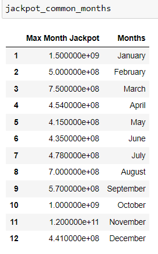

The maximum Jackpot values per month are presented in this Table.  We then graphed these values as a Bar graph.

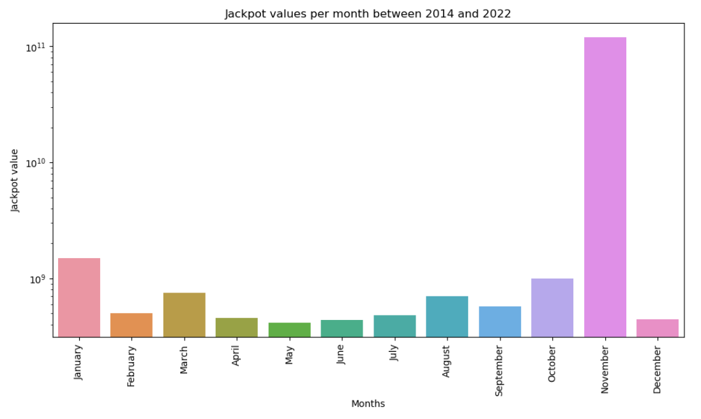

From this graph we could see that from June 2014 to Novemeber 2022, the winter months appear to have higher winning jackpot values.  Novemeber actually has a massive spike to 10e11.  We decided to dive a little bit deeper to see what is going on with this data.

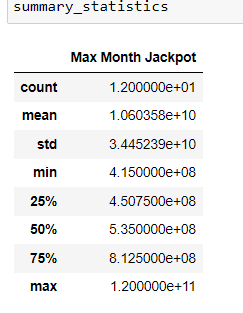

From this summary statistics for the Max Monthly Jackpot, we actually have a maximum value of 1.2e11 which is an extreme outlier which could skew our data.  

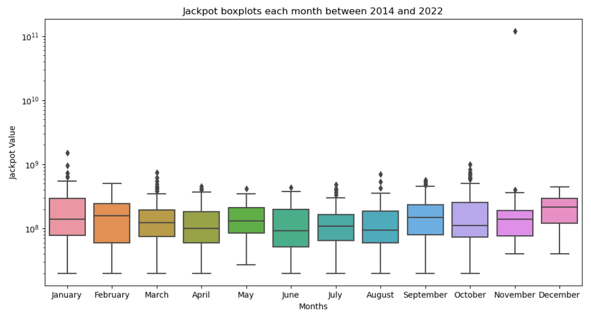

We plotted the boxplots of every single Jackpot for every single month, there are some outliers present in the other months.  However, the November outlier is clearly visible.  This value is the last data point that we have from the Washington Powerball is a winning value in November 2022 of 120,000,000,000$.  Even with this outlier, we decided to keep it in since it was a legitimate win.  We then performed a linear regression over the maximum Jackpots per month.

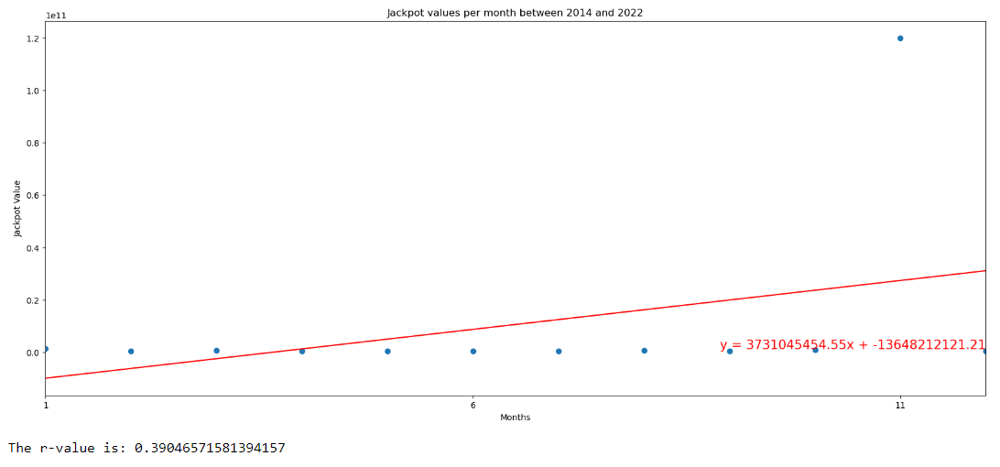

From this data we can see that there is actually a moderate correlation in the positive direction meaning that as the year goes on, players of Powerball will have increased Jackpots that they could win

6. What were the common maximum jackpots per year?

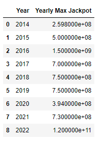

The Table shows the maximum jackpots per year.

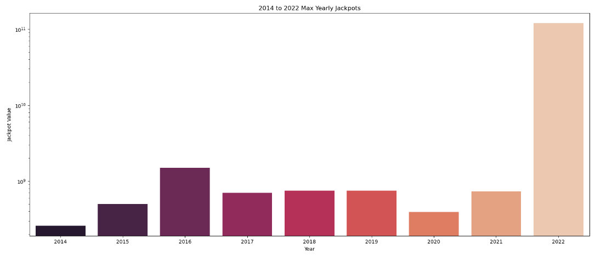

To better visualize the data we then went ahead and made a bar graph that shows has the Maximum Jackpot that was won for each year.  Again 2022 Jackpot dwarfs the earlier years because of the 120 billion dollar Jackpot in November.

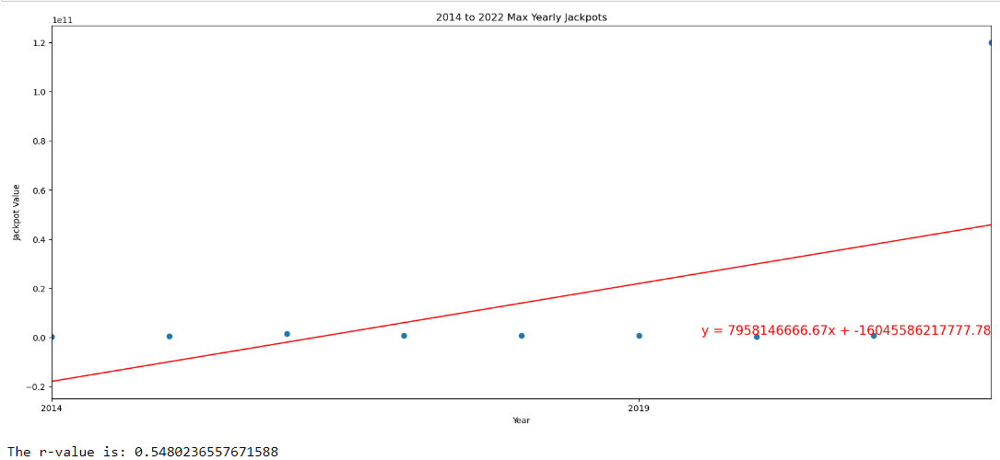

We performed a Linear Regression line to see if there was any correlation between time in years to Jackpot Values.  There was a moderately strong positive correlation of 0.55 that each year the Jackpot became greater and greater in value.

# Conclusion

In this project, we analyzed the Washington Powerball/Powerplay Lottery data from June 2014 to November 2022. We found that the most common winning Powerplay value was 2, while the most common winning Powerball numbers were 18 and 25. The top five most common white numbers that were drawn as winning numbers were 21, 28, 32, 36, and 39. We also found that there was a weak negative correlation between the white numbers and the powerball number, suggesting that lower white numbers were more likely to be paired with higher powerball numbers. We also observed that the jackpots tended to be higher in the winter months, especially in November, which had an extreme outlier of $120 billion in 2022. We also detected a moderate positive correlation between the jackpots and the time index, indicating that the jackpots increased over time on average.

Our analysis has some limitations and assumptions that should be acknowledged. First, our data source was from Kaggle, which may not be the most reliable or updated source of information. Second, our sample size was relatively small, as we only had data for 8 years and 6 months. Third, our time period was limited by the availability of the data, which may not capture the long-term patterns or changes of the lottery game. Fourth, our statistical methods were based on simple descriptive and inferential statistics, which may not account for all the complexities and uncertainties of the data.

For future work, we suggest some possible directions or recommendations for further research or action. First, we could explore other factors that could affect the lottery outcomes, such as the number of tickets sold, the number of rollovers, and the changes in the game rules. Second, we could test different hypotheses or models for predicting or explaining the lottery outcomes, such as using machine learning or causal inference methods. Third, we could apply different methods or tools for analyzing or visualizing the data.

# ubiquitous-goggles
